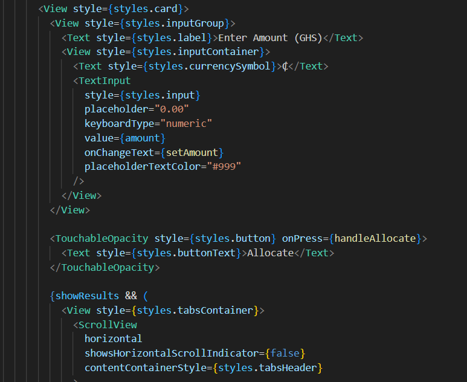

# 💰 Smart Budget

Smart Budget is a simple and elegant React Native app built with Expo that helps you allocate your money wisely. Just enter an amount, and it automatically distributes it into four categories: Investment, Tithe, Emergency, and Wants.



 

---

## ✨ Features

- Clean, minimalist UI
- Automatic allocation based on standard budgeting rules
- Tabbed breakdown of category-wise allocation
- Responsive and interactive layout

---

## 🚀 Getting Started

To run the project locally:

```bash
# Clone the repository
git clone https://github.com/KumiAmponsah/smart-budget.git

# Navigate to the project directory
cd smart-budget

# Install dependencies
npm install

# Start the Expo development server
npx expo start
```

---

## 🧠 Allocation Logic

- **50%** - Investment
- **10%** - Tithe
- **15%** - Emergency
- **25%** - Wants

All calculations are handled dynamically based on user input.

---

## 📱 Tech Stack

- [React Native](https://reactnative.dev/)
- [Expo](https://expo.dev/)
- TypeScript

---

## 🙌 Author

Developed with 💜 by [Kumi Amponsah](https://github.com/KumiAmponsah)

---
